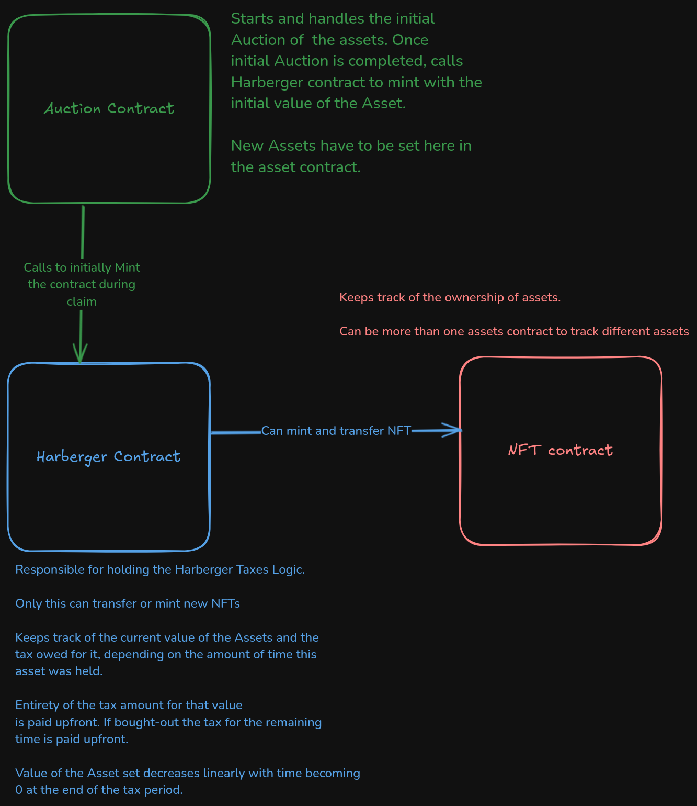

# Harberger Taxation

**This repo consists of a governance and taxation experiment to be conducted at ZuGram using Harberger taxes.**

An Asset is represented by a Soulbound token(NFT) whose ownership can only be transferred after a successful Harberger buyout. The Soulbound Token is initially auctioned and minted by an Auction contract.  After the auction is complete, to claim the Asset the winning bidder will have to set their initial value of the SBT. 

A percentage of that Value they set, will have to be paid as taxes.

## Proposed Working

### Non Techincal Explanation

- A Soulbound Token is used to track the ownership of the Assets.
- The Asset will be initially sold off using a simple auction mechanism, (highest bidder gets the asset) . Separate Auctions for the individual assets.
- The winning bidder gets to set the initial price of the asset while claiming the asset as its owner. This price is used to calculate the tax paid on it. (Tax is a percentage of the price set). Tax rate yet to be decided
- Anyone can automatically buy the Asset from the owner for the price set by the owner and set a new price on which they will be taxed. The previous owner will be charged for the price they set upto that point in time.
- The Owner of the asset will thus be incentivized to set the price of their asset near to the optimum price, cause if it is undervalued someone might buy it from them and if its overvalued they'll be paying a high amount tax because of it. 

## Workings

- Auction contract is used to auction off the Asset initially, starts/stops the auction, manages the funds for bidding and sets the details of the asset.
- Harberger Contract works to set the value of the Asset by its current owner, and for buyers to snip it from users. Also used to mint assets after the auction is complete and to calculate and pay the harberger tax. Its also responsible for transferring ownership once the buyer buys out the asset from the current owner.
- SBT contract is the Soulbound Token used to track the current owner



## Getting Started

### Install Dependencies
```shell
$ forge install
```

### Build

```shell
$ forge build
```

### Test

```shell
$ forge test
```

## Contracts
There are three contracts which contain the initial auctioning mechanism, Harberger mechanism, and a Soulbound Token denoting the current ownership of the asset.

### Auction Contract 

